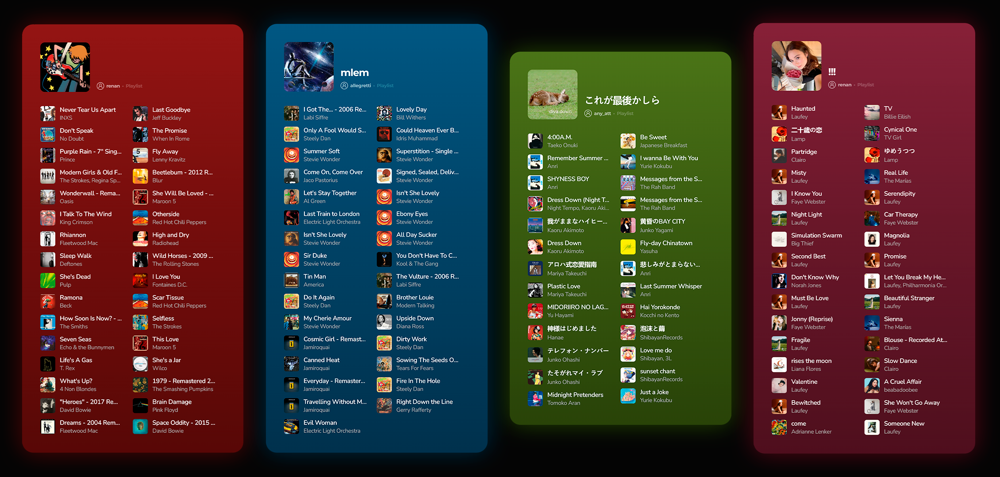

# tiletape.
Transform your Spotify playlist into an iconic poster! Access the live application here: https://tiletape.vercel.app/ 🔗



**tiletape.** is a fullstack application built to generate high-quality visual cards from Spotify playlists. The system reads the playlist, actively extracts a color palette based on its artwork, and generates a customized poster ready for download. The architecture is cleanly split into a React frontend application and a Node.js backend API.

## 🚀 Features

* **Link transformation:** The user inputs the Spotify playlist URL and the application handles the rest.
* **Color extraction:** The playlist cover is downloaded by the system, which leverages the `node-vibrant` and `colorthief` libraries to extract a themed color palette.
* **Automatic contrast adjustment:** To avoid excessively bright colors (flashbangs), custom logic processes the extracted colors to ensure maximum legibility for the white text on the generated card.
* **Image generation (headless browser):** The backend injects the playlist data into an HTML template (`playlist.html`) and uses `puppeteer` to capture and render a high-resolution card.
* **Dynamic 3D preview:** On the frontend, the rendered card responds interactively to mouse movements or user touch, creating a visual 3D tilt and glare effect.
* **Simple download:** With a single click on the action button, users can download the generated image as a `.png` file.

## 🛠️ Tech Stack

### Frontend
* **React & Vite:** For fast interface rendering and bundling.
* **React Router DOM:** To manage navigation between `HomePage` and `PlaylistPage`.
* **CSS:** Modularized styling across files like `CardViewer.css` and `HomePage.css`, including dynamic CSS custom property calculations for rotation and lighting animations.

### Backend
* **Node.js & Express:** API routing configuration and server running on port 3001.
* **Puppeteer:** Core tool to simulate the poster layout page and capture screenshots.
* **Spotify Authentication:** Integration via the Client Credentials protocol to fetch access tokens from the Spotify API.
* **Node-Vibrant and ColorThief:** Used within the `colorExtractor.js` service to analyze the image Buffer and retrieve dominant hex codes.

## 📁 Project Structure

Below is the breakdown of the repository's main directories:

```text
└── ./
    ├── client/                # Frontend Application
    │   ├── src/
    │   │   ├── components/    # Reusable components (CardViewer, LoadingViewer)
    │   │   ├── pages/         # Main pages (HomePage, PlaylistPage)
    │   │   └── utils/         # Utility functions like color darkening
    │   └── vite.config.js     # Vite proxy configuration
    │
    └── server/                # Backend API
        ├── routes/            # Route definitions (playlist.js, download.js)
        ├── services/          # Business logic (spotify, imageGenerator, colorExtractor)
        ├── templates/         # HTML template for the Puppeteer card (playlist.html)
        └── index.js           # Express server entry point
```

## 🚀 Para execução local

To run this application locally, you will need Node.js (v18+) and developer credentials from the Spotify Dashboard.

To configure your Spotify Developer credentials, create a `.env` file inside the `server/` folder with the following content:

```
SPOTIFY_CLIENT_ID=your_client_id_here
SPOTIFY_CLIENT_SECRET=your_client_secret_here
PORT=3001
```

Once configured, simply install the dependencies and spin up the services by following these steps:

1. Open your terminal in the `server/` directory to start the API:

```
cd server
npm install
npm start
```

2. Open another terminal in the `client/` directory to start the Frontend interface:

```
cd client
npm install
npm run dev
```

3. Access `http://localhost:5173` in your browser to view the project running locally.

## 🌐 Deploy

The project's architecture is fully production-ready, utilizing **Vercel** for Frontend hosting and **Render/Docker** for Backend hosting.
